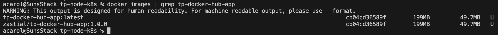
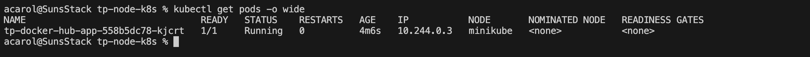
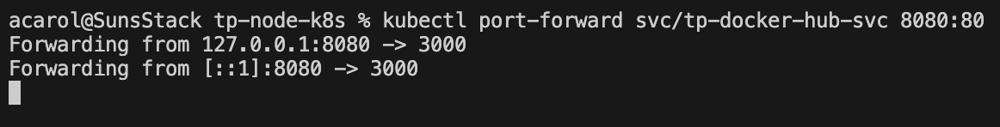
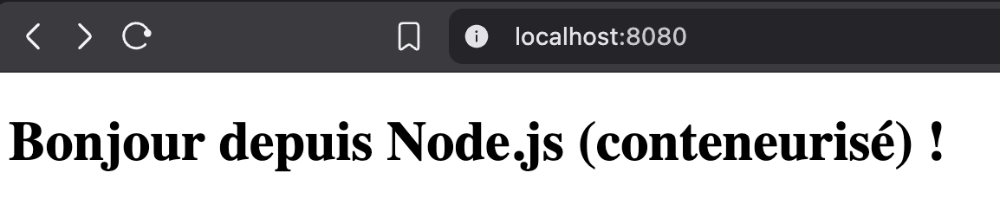
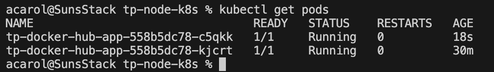

# TP Déploiement d’une image depuis un registre privé sur le cluster Kubernetes

Author: Alexandre CAROL

# Livrables

`docker images | grep tp-docker-hub-app`

`kubectl get pods -o wide`

Acces web via port-forward et page affichee.

### Réponses courtes :

- **3 optimisations mises en place dans le Dockerfile et pourquoi :**
Utilisation d'un build multi-stage, copie seulement des fichiers utiles et activation de `NODE_ENV=production` pour avoir une image plus légère.

- **À quoi sert imagePullSecrets et comment vous l'avez configuré :** imagePullSecrets permet a Kubernetes de pull une image privée et il est configureé avec le secret `regcred` créé avec `kubectl create secret docker-registry`.

## Bonus

### Double replicas :

